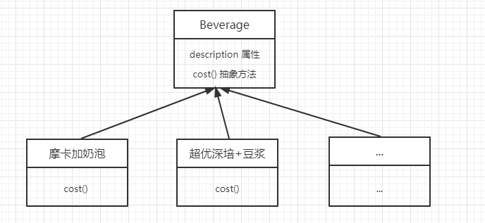
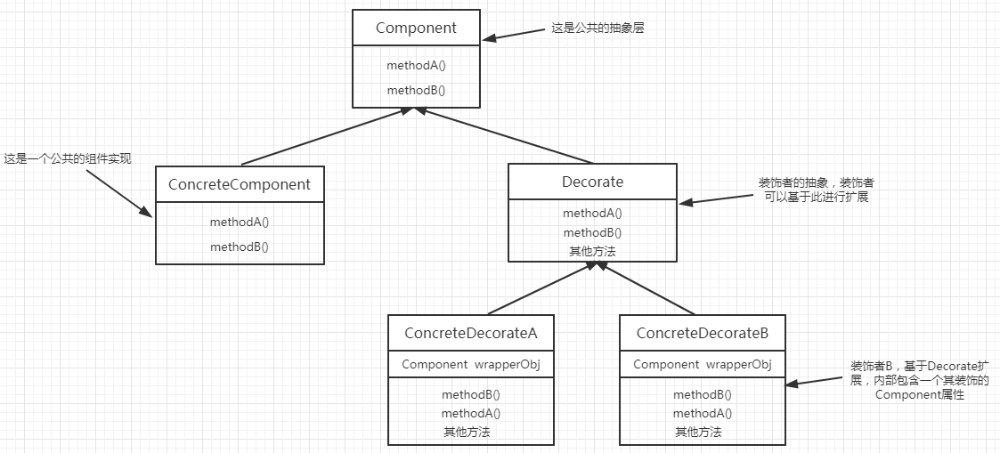
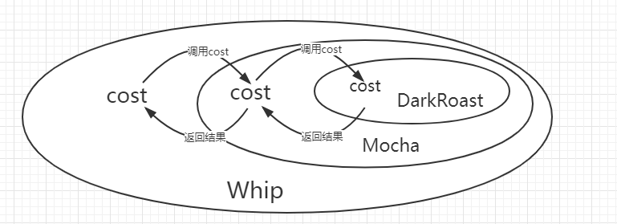
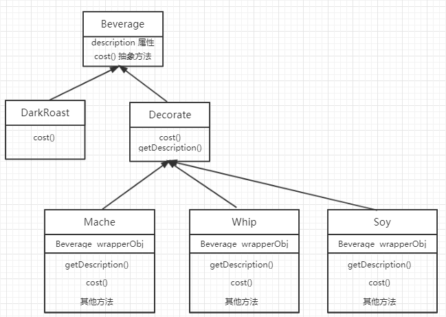

# 装饰模式介绍

## 需求

假设现在有抽象基类**饮料（Beverage）**，包含了一个需要实现的cost方法，计算实际的开销。

需求如下：购买咖啡时需要加入调料，现有**豆浆（Soy）**、**摩卡（Mocha）**、**超优深培咖啡豆（DarkRoast）**
或**覆盖奶泡（Whip）**，并且未来可能会有更多调料，又或者调料可以加双份。
现需要根据顾客所加的调料计算出最终的消费金额。

## 实现

+ ### 坏的实现

每种调料组合都继承自**饮料（Beverage）**，实现自己的cost方法。

缺点：
1. 每次新增一种组合，如摩卡+豆浆，都需要增加一个实现类，扩展性很差。
2. 没有封装变化的部分，需要创建类会越来越多。

+ ### 装饰模式的实现

  + ####  装饰模式包含角色
	基础组件：装饰者和被装饰共同实现的抽象。
	
	被装饰者：包含在装饰者中，每个装饰者包含一个被装饰者的属性。

	装饰者：装饰被装饰者。

	注意：装饰者是可以相互装饰的，即装饰者也可以装饰装饰者。

   + ####  装饰模式的UML图
   

   + #### 把装饰者模式套用到设计的需求
	 如：用户需要一杯**摩卡（Mocha）**和**奶泡（Whip）** 的深培咖啡 **（DarkRoast）**
     
     实现方式：
	 1. 先创建一个DarkRoast。
	 2. 再创建一个Whip对象，再用Whip装饰DarkRoast对象。
	 3. 再创建Whip对象装饰上面的对象。
	 
	 实现如图：
	 
	 
	 
	 UML图：
	 
	 
     
     
+ ### 装饰模式的利与弊

   + ####  装饰模式的好处
	 1. 遵循了开闭原则，对行为的扩展是开放的。
	 2. 封装了变化的部分，只要存在行为的定义，则可以进行任意的行为组合。
	 
   + ####  装饰模式的坏处
	 1. 当组合过多时，要创建太多对象，进行层层包装。
	 2. 当创建对象过多时，包装也多，执行流程相对较难理解。
	 2. 装饰模式是整条链路，装饰者很难知道下级还有多少个包装。

