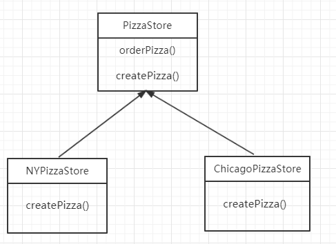

#  工厂模式

##### 首先纠正一个误区

>  简单工厂并不是一种设计模式，更像是一种编程习惯。       
 -- 摘自《Head First》


+ ##  工厂方法模式

###  需求

假设现在有接口**披萨（Pizza）**，包含了准备 **（prepare）**、 **烘烤（bake）**、 **切块（cut）**、装盒 **（box）** 等方法需要实现。
不同的披萨有不同的实现方式。披萨店需要制作不同的披萨满足不同客户的需求，不同披萨店做出的口味不一样。

需求如下：设计披萨店（PizzaStore），使其能根据不同的用户需求做出不同的披萨 **（CheesePizza、ClamPizza、VeggiePizza等）**。

+ ###  实现方式一

```
public void orderPizza(String type) {
	Pizza pizza;
	// 创建披萨的方式与披萨制作耦合，将来披萨增多这里需要反复修改
	if (type.equals("cheese")) {
	    pizza = new CheesePizza();
	} else if (type.equals("clam")) {
	    pizza = new ClamPizza();
	} else {
	    pizza = new VeggiePizza();
	}
	pizza.prepare();
	pizza.bake();
	pizza.cut();
	pizza.box();
}
```

+ ###  实现方式二（工厂方法模式）

   + 简介：父类封装对象的产品操作，创建产品的工作交给子类实现，不同子类可以创建不同的对象。

   + UML图
    
    
    
    如上图，当新增披萨店时，只需要继续新增类，实现自己的创建逻辑即可，PizzaStore的代码不需要改变。


### 依赖倒置原则 **（不一定非要遵守此原则）**

+ 指导方针

   1. 变量不可以持有具体类的引用，即变量要使用接口声明。
   
   2. 不要让类派生自具体的类。
   
   3. 不要覆盖基类已经实现的方法，即基类实现的方法应该让所有类共享。
   
   